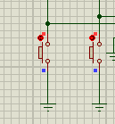
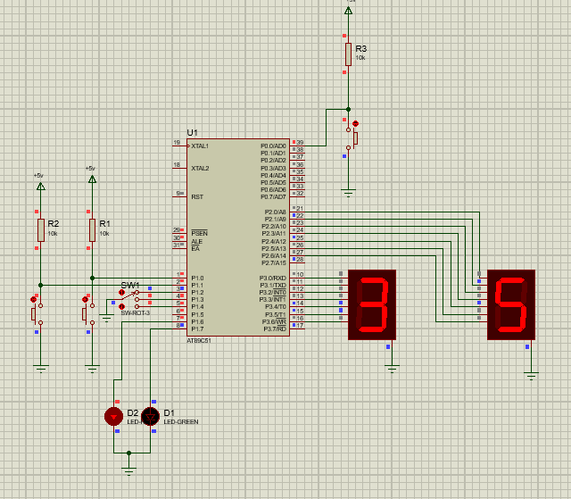

<center><h1><span style="color: lightblue ; ">Traffic Light Project </span> </h1></center> <br>

<h2><span style="color: pink ; ">Team 17 :</span></h2> 
<ul>
<li><span style="color: grey ; "> Mohammed Elsayed.</span></li>
<li><span style="color: grey ; "> Abdullah Drwesh.</span></li>
<li><span style="color: grey ; "> Esraa Sayed.</span></li>
<li><span style="color: grey ; "> Zeinab Walid.</span></li>
</ul>
<br>

<h2><span style="color: pink ; "> Introduction: </span></h2>
<p>
<span style="color: grey ; ">
&nbsp;&nbsp; We implement a traffic light system that allow the user to change between red and green leds. The user can adjust the duration of each led depending on the traffic jam using two push buttons. Each push button controls a 7-segment.The two 7-segments display the duration for each led from 99 second till zero and the user has the flexibility to adjust the time up on need. After the user set the needed time, he should confirm that time using third push button, then the two 7-segments start to count down from the adjusted time till zero, then the two leds alternate and the 7-segments start to count down again till zero and so on. Also, the user can control the speed of counting down with 3 levels 'fast , normal and slow'.
We used Proteus 8.6 to make simulation for the system, and Keil uVision4 to implement the system.
</span>
</p> 
<br>

<h2> <span style="color: pink ; "> Code: </span></h2>

<h3><span style="color: grey ; ">1- Initializations for registers and pins.</span></h3>

```c
;#include "C8051F020.h"
ORG 00H

SW1 BIT P1.0
SW2 BIT P1.1
BEGIN BIT P0.0
	
R_LED BIT P1.6
G_LED BIT P1.7
	
SETB SW1
SETB SW2
SETB BEGIN

SETB R_LED
CLR G_LED

MOV R1, #00H                         ;Digit1 num
MOV R2, #00H                         ;Digit2 num
MOV DPTR, #200H  

```
<br>

<h3><span style="color: grey ; ">2- Default state of 7 Segments and handle to get input from user.</span> </h3>

```c
INIT: 
	MOV A, R1
	MOVC A, @A+DPTR
	MOV P2, A
	MOV A, R2 
	MOVC A, @A+DPTR
	MOV P3, A

JNB BEGIN,START

JNB SW1,INCREMENT1
JNB SW2,INCREMENT2

SJMP INIT 

```
<br>

<h3><span style="color: grey ; ">3- Adjust duration of leds using the two push buttons.</span></h3> 

```c
INCREMENT1:
	CJNE R1, #09H, IN1
	MOV R1,#00H
	ACALL DELAY
	SJMP INIT
	IN1:INC R1
	ACALL DELAY
	SJMP INIT
	
INCREMENT2:
	CJNE R2,#09H,IN2
	MOV R2,#00H
	ACALL DELAY
	SJMP INIT
	IN2:INC R2
	ACALL DELAY
	SJMP INIT
```
<br>

<h3><span style="color: grey ; ">4-Starting of system after storing values from user in 60H & 50H in each cycle.</span> </h3> 

```c
START:
	MOV 60H,R1
	MOV 50H,R2
	
	
	JNB P1.2,A0
	JNB P1.3,A1
	JNB P1.4,A2
	L:
	MOV DPTR,#20FH
	MOVC A,@A+DPTR
	MOV 61H,A
	MOV DPTR,#200H
	SJMP MAIN
	
A0:MOV A ,#00H
SJMP L
A1:MOV A ,#01H
SJMP L
A2:MOV A ,#02H
SJMP L
```
<br>

<h3><span style="color: grey ; ">5- The count down of 7 segment till reach zero then toogle led and start counting again and so on.</span>  </h3> 

```c
MAIN: 
	ACALL DELAY1
	MOV A, R1
	MOVC A, @A+DPTR
	MOV P2, A
	MOV A, R2 
	MOVC A, @A+DPTR
	MOV P3, A
	
DEC1:
	CJNE R1,#00H,DC1
	MOV R1,#09H
	SJMP DEC2
	DC1:DEC R1
	SJMP MAIN

DEC2:
	CJNE R2,#00H,DC2
	SJMP FINISH
	DC2:DEC R2
	SJMP MAIN
	
FINISH:
	CPL R_LED
	CPL G_LED
	MOV R1,60H
	MOV R2,50H
	SJMP START
```
<br>

<h3><span style="color: grey ; ">6- Two look up tables , the first is to regulate input of 7 segment and the second is to regulate speed adjusted by user"Slow or Normal or fast".</span></h3> 

```c
ORG 200H 
DB 3FH, 06H, 5BH, 4FH, 66H, 6DH, 7DH, 07H, 7FH, 6FH 
	
ORG 20FH
DB 05H, 0AH, 014H 

```
<br>
<h3><span style="color: grey ; "> 7- Delay Functions to adjust the speed of counting down.</span> </h3>

```c
DELAY:
	MOV R3,#02H
	UP2:MOV R4,#0FFH 
	UP1: MOV R5, #0FFH 
	HERE: DJNZ R5, HERE 
		DJNZ R4, UP1 
		DJNZ R3, UP2 
	RET
	
DELAY1:
	
	MOV R3, 61H
	UP22:MOV R4,#00H 
	UP11: MOV R5, #0C8H
	HERE1: DJNZ R5, HERE1 
		DJNZ R4, UP11 
		DJNZ R3, UP22 
	RET
	

END

 ```
 <br>

<h2> <span style="color: pink ; "> Schematic Circuit : </span></h2>

<h3><span style="color: grey ; ">Default view of Traffic Light System.</span></h3>


<br>

<h3><span style="color: grey ; ">Two push buttons to adjust duration needed by user.</span></h3>


 <center>   </center>
<br>

<h3><span style="color: grey ; ">User's adjustment for the speed of counting down:</span></h3>
<h5><span style="color: grey ; ">1- High Speed.</span></h5>

<center>   </center>
<br>

<h5><span style="color: grey ; ">2- Normal Speed.</span></h5>

 <center>   </center>
<br>

<h5><span style="color: grey ; ">3- Low Speed.</span></h5>
  
  <center>   </center>
<br>


<h3><span style="color: grey ; ">The duration displayed on 7 segments up on user's adjustment.</span></h3>

  

<br>


<h3><span style="color: grey ; ">Start button that confirm all user's adjustments.</span></h3>


<center>   </center>

<br>

<h3><span style="color: grey ; ">Count Down displayed on 7 segments.</span></h3>


<br>  

<h3><span style="color: grey ; ">Toogling of the two leds after the 7 segments reach to zero.</span></h3>


<center>   </center>
<br>

<h3><span style="color: grey ; ">New cycle for the other led.</span></h3>


<center>   </center>

<br>


